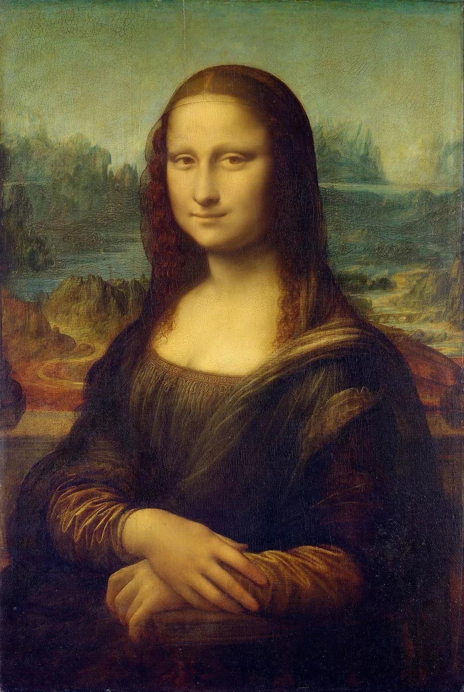

# Project: Can you recognize the emotion from an image of a face? 


### [Full Project Description](doc/project3_desc.md)

Term: Fall 2019

+ Team 1
+ Team members
	+ 1 Thomson Batidzirai
	+ 2 Feichi Gu
	+ 3 Chang Qu
	+ 4 Young Sim
	+ 5 Mo Yang
	

+ Project summary: 
In this project, we created a classification engine for facial emotion recognition using Python and R. Firstly, we identified the necessary features including, the original features, extract HOG, PCA, and RGB (we don't use this one in the end) features, and Choose 23 points (MyFeature1) and 5 groups of points (MyFeatures2) to calculate the distance between them. Then, we built and tested models such as boosted decision stump(baseline model), XGBoost, linear SVM, Random Forest, LGBM, Logistic Regression, CNN, etc. By comparing the accuracy and the computational time between each combination, we got our final model, which is a soft voting classifier combining LGBM (dart), Random Forest, Logistic Regression, and linear SVM.

	
**Contribution statement**: 
+ Young Sim (Project Leader)
               
	+ Build and train/test baseline boosted decision stump model in Python
	+ Build and train/test voting classifier model in Python
	+ Write main.ipynb
	+ Write scripts for feature extraction and training/testing for CNN in Python
	
+ Thomson Batidzirai  
        
    + Train and test XGboosting model based on PCA, HOG, RGB and Features we choose by ourselves in R
    + Make the PPT and give the presentation
	
+ Feichi Gu
   
	+ Data processing: include data splitting and cleaning 
	+ Build the HOG and PCA function and Extract HOG and PCA features (pick the best parameter of HOG and PCA) in R
	+ Choose 23 points and 5 groups of points to calculate the distance between them, and build our dataset1 and dataset2
	
+ Mo Yang          
                
	+ Conduct image exploration before extracting new features and Review those previous researches in this area.
	+ Build the RGB function and Extract RGB features in R
	+ Generate README.Rmd 
	
	
+ Chang Qu  
  + Train and test SVM (linear) and random froest model based on PCA, HOG, and the features we choose by ourselves (pick the best parameter of SVM model, test using cross validation) in R


Following [suggestions](http://nicercode.github.io/blog/2013-04-05-projects/) by [RICH FITZJOHN](http://nicercode.github.io/about/#Team) (@richfitz). This folder is orgarnized as follows.

```
proj/
├── lib/
├── data/
├── doc/
├── figs/
└── output/
```

Please see each subfolder for a README file.
